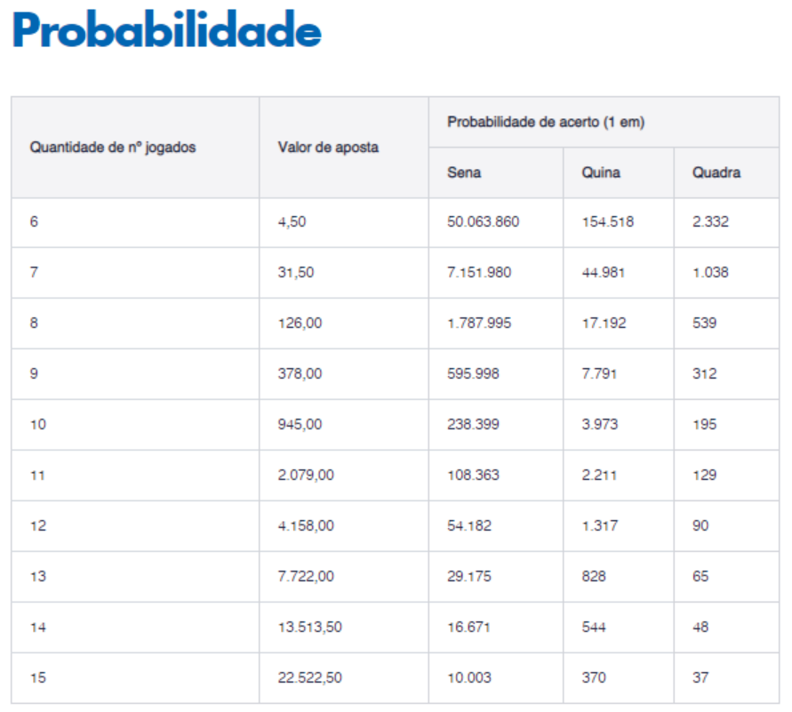
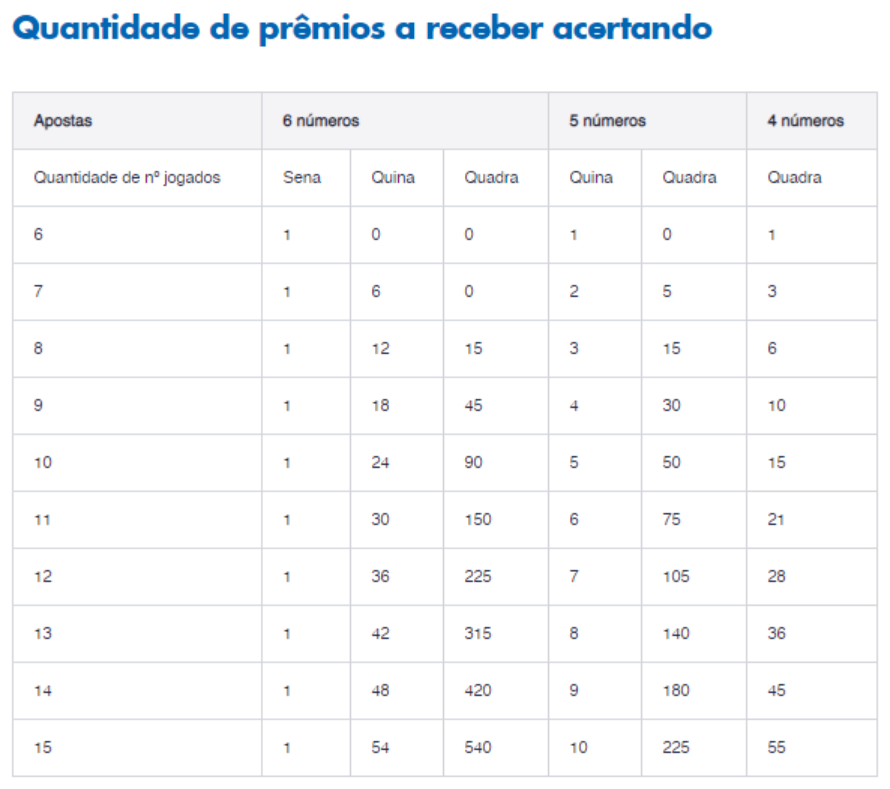
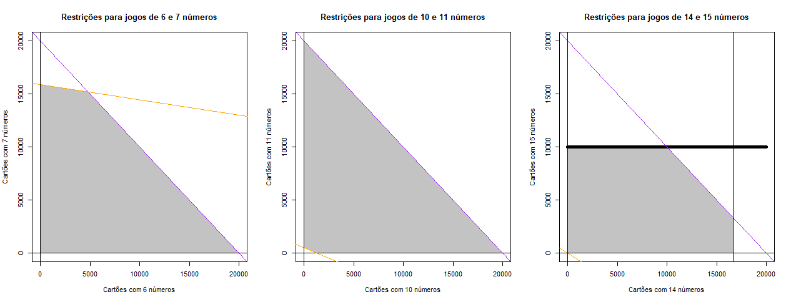

```{r setup, include=FALSE}
knitr::opts_chunk$set(echo = TRUE, results="hide")
```

## Introdução

  <!-- \Large -->
  A Mega-Sena é a maior modalidade lotérica atualmente no Brasil. Lançada em 1996, a loteria é organizada pela Caixa Econômica Federal (CAIXA). Para apostar na Mega-Sena, o jogador escolhe de 6 a 15 números entre as dezenas numeradas de 01 a 60. 

  Os sorteios das seis dezenas premiadas são realizados duas vezes por semana. Caso acerte os 6 números sorteados, o jogador leva o prêmio correspondente à Sena (faixa 1). Se acertar 5 números, ganha o prêmio da Quina (faixa 2). Por outro lado, se acertar 4 números, leva o prêmio da Quadra (faixa 3).

  Essas informações estão no site de [Loterias da CAIXA](http://loterias.caixa.gov.br/wps/portal/loterias), onde se pode ver, acessando o link correspondente à Mega-Sena, a seguinte imagem de chamada à aposta:


  Por outro lado, o próprio site fornece dados valiosos para que o jogador possa tomar suas decisões de aposta. Nesse diapasão, faremos uma análise dos dados disponíveis para a Mega-Sena em busca de responder às seguintes perguntas:

<!-- \begin{enumerate} -->
<!--   \item Existe alguma estratégia de jogo mais favorável ao apostador?  -->
<!--   \item É possível determinar a relação custo x retorno das apostas? -->
<!-- \end{enumerate} -->

<!-- \newpage -->

<ol type="1">
  <li> Existe alguma estratégia de jogo mais favorável ao apostador? </li>
  <li> É possível determinar a relação custo x retorno das apostas? </li>
</ol>

## Noções elementares sobre probabilidades e loterias

  <!-- \normalsize -->
  Com o intuito de responder às perguntas levantadas, precisamos compreender algumas premissas, que são características dos jogos de loteria ou consequências da
<u> Teoria das Probabilidades </u>:  
<!-- \underline{Teoria das Probabilidades}: -->

<!-- \begin{itemize} -->
<!--   \item Os sorteios são de fato aleatórios, ou seja, não existe viés significativo nos resultados sorteados; -->
<!--   \item a cada sorteio, o fato de o jogador ganhar uma faixa de premiação não o impede de levar junto outros prêmios menores; -->
<!--   \item todos os sorteios são independentes, isto é, o resultado de um sorteio não interfere em outro. -->
<!-- \end{itemize} -->

<ul>
  <li> Os sorteios são de fato aleatórios, ou seja, não existe viés significativo nos resultados sorteados; </li>
  <li> a cada sorteio, o fato de o jogador ganhar uma faixa de premiação não o impede de levar junto outros prêmios menores; </li>
  <li> todos os sorteios são independentes, isto é, o resultado de um sorteio não interfere em outro. </li>
</ul>

  Em adição às premissas supracitadas, faz-se necessário entender como são calculadas as probabilidades de ganhar em uma loteria tal qual a Mega-Sena.

  Um <u>jogo de loteria</u> nada mais é do que a aposta numa combinação de números, com a esperança de que a combinação escolhida seja sorteada para ganhar o prêmio. Esse sorteio favorável possui uma probabilidade de ocorrência, que pode ser mensurada usando os conceitos de Combinação e Probabilidade Frequentista.

  Uma <u>combinação</u> é essencialmente a contagem do número de escolhas dentro de um conjunto de possibilidades, independentemente da ordenação dos elementos escolhidos. Na Mega-Sena, uma aposta simples consiste em selecionar exatos 6 números em um conjunto de 60 possíveis escolhas (as dezenas de 01 a 60). 

  Em suma, o processo de contar quantas escolhas de apostas simples são possíveis na Mega-Sena consiste em enumerar de quantas maneiras o jogador pode preencher 6 espaços vazios em seu cartão com os 60 números disponíveis. Para o primeiro espaço, tem 60 possibilidades, para o segundo 59, para o terceiro 58 e assim por diante. O produto das possibilidades contabiliza o total de escolhas "embaralhadas" dos números. Por causa disso, não se pode esquecer de dividir o total obtido pela quantidade de "embaralhadas" em cada grupo de 6 números escolhidos, já que a permutação na ordem deles leva à contagem de apostas repetidas. Assim, o total de possíveis <u>apostas simples</u> na Mega-Sena é dado matematicamente pela expressão abaixo:

$$ C_6^{60} = \frac{60!}{6!(60-6)!} = \frac{60 \times 59 \times 58 \times 57 \times 56 \times 55}{6 \times 5 \times 4 \times 3 \times 2 \times 1} = 50.063.860 $$

  Além da notação de combinação introduzida acima, é necessário entender também a definição clássica de probabilidade. Quando queremos saber a chance de ocorrer um evento, intuitivamente avaliamos os casos que são favoráveis em relação ao total de casos possíveis. Em resumo, essa relação, mais especificamente, essa razão entre os casos favoráveis e os possíveis constitui a chamada <u>definição frequentista de probabilidade</u>. 

  Ela pode ser usada para verificar, por exemplo, que a probabilidade de acertar a Sena ao jogar um cartão com 8 números é a razão entre o total de <u>casos favoráveis</u> (nesse contexto as combinações de 6 números que estão entre os 8 selecionados) e o total de <u>casos possíveis</u> (todas as combinações de 6 números entre os 60 disponíveis), isto é:

$$ \frac{C_6^{8}}{C_6^{60}} = \frac{28}{50.063.860} = \frac{1}{1.787.995} $$

  Unindo esses conceitos a outros de <u>análise combinatória</u>, é possível demonstrar resultados curiosos como:  
  
<!-- \begin{itemize} -->
<!--   \item a chance de acertar uma {\bf Quina}, jogando um cartão com 7 números na Mega-Sena é dada por -->

<!-- \[\frac{C_5^{7}\times C_1^{53}}{C_6^{60}} = \frac{21 \times 53}{50.063.860} = \frac{1113}{50.063.860} \approx \frac{1}{44.981}\] -->

<!--   \item o número de prêmios da {\bf Quadra} que se leva ao acertar a {\bf Sena} com uma aposta de 13 números na Mega-Sena é -->

<!-- \[ C_4^{6} \times C_2^{7} = 15 \times 21 = 315 \]   -->

<!-- \end{itemize}   -->

<ul>
  <li> a chance de acertar uma <strong>Quina</strong>, jogando um cartão com 7 números na Mega-Sena é dada por

$$ \frac{C_5^{7}\times C_1^{53}}{C_6^{60}} = \frac{21 \times 53}{50.063.860} = \frac{1113}{50.063.860} \approx \frac{1}{44.981} $$

  </li> 
  
  <li> o número de prêmios da <strong>Quadra</strong> que se leva ao acertar a <strong> Sena </strong> com uma aposta de 13 números na Mega-Sena é
  
  $$ C_4^{6} \times C_2^{7} = 15 \times 21 = 315 $$  
  </li>
</ul>

  Tudo isso e mais um pouco está nas entrelinhas dos dados sobre a Mega-Sena. São eles que iremos explorar nesta análise, a fim de determinar se existe uma estratégia vencedora na Mega-Sena que atenda às premissas, com uma relação custo x retorno efetivamente calculável.
  
  Com tal finalidade, usaremos dados das seguintes fontes: [Página da Mega-Sena no Site da CAIXA](http://loterias.caixa.gov.br/wps/portal/loterias/landing/megasena), para obter os dados principais, e [Plataforma SIDRA do IBGE](https://sidra.ibge.gov.br/tabela/1736), para obter dados da série histórica do Índice Nacional de Preços ao Consumidor (INPC). Ademais, aplicaremos ferramentas de análise de dados da linguagem de programação R, através do Software R versão 4.0.5, na IDE RStudio versão 1.4.1103. Começamos apresentando os pacotes do repositório [CRAN](https://cran.r-project.org/web/packages/available_packages_by_name.html) do R a serem utilizados, os quais, após instalados pelo comando "install.packages(package_name)", podem ser carregados da forma a seguir:  

```{r libraries, message = FALSE}
# Carregamento dos pacotes a serem utilizados

library(rvest) # Leitura de dados no padrão html
library(sidrar) # Leitura de dados da plataforma SIDRA do IBGE
library(dplyr) # Manipulação de bancos de dados
library(tidyr) # Transformação de dados
library(readr) # Recursos de leitura e formatação de dados
library(stringr) # Manipulação de strings
library(ggplot2) # Recursos gráficos
library(lpSolve) # Otimização linear e inteira
```

  A leitura dos dados pelo R diretamente das fontes indicadas pode ser feita por meio dos seguintes comandos:
<!-- \newline -->
<br>
<!-- \footnotesize -->
```{r read}
# Leitura dos dados

# Resultados da Mega Sena no site da CAIXA
url_link <-"http://loterias.CAIXA.gov.br/wps/portal/loterias/landing/megasena/!ut/p/a1/04_Sj9CPykssy0xPLMnMz0vMAfGjzOLNDH0MPAzcDbwMPI0sDBxNXAOMwrzCjA0sjIEKIoEKnN0dPUzMfQwMDEwsjAw8XZw8XMwtfQ0MPM2I02-AAzgaENIfrh-FqsQ9wNnUwNHfxcnSwBgIDUyhCvA5EawAjxsKckMjDDI9FQE-F4ca/dl5/d5/L2dBISEvZ0FBIS9nQSEh/pw/Z7_HGK818G0K8DBC0QPVN93KQ10G1/res/id=historicoHTML/c=cacheLevelPage/=/"
resultados <- url_link %>%
  read_html() %>%
  html_nodes(xpath='/html/body/table/tbody')
resultados <- html_table(resultados, header = F, dec = ",")

# Série da variação mensal do INPC desde janeiro/1994 obtida da plataforma SIDRA do IBGE via parâmetros para API
inpc <- get_sidra(api="/t/1736/n1/all/v/44/p/last%20331/d/v44%202")
 
```

```{r adj_transf, message = FALSE}
# Limpeza e tratamento dos dados

resultados <- data.frame(resultados[[1]][,1:21])
colnames(resultados)<-c("Concurso","Local","Data_sorteio","Coluna1","Coluna2","Coluna3","Coluna4","Coluna5","Coluna6",
                                                "Ganhadores_faixa1","Ganhadores_faixa2","Ganhadores_faixa3","Rateio_faixa1","Rateio_faixa2","Rateio_faixa3",
                                                "Cidade","Valor_arrecadado","Estimativa_proximoconcurso","Valoracumulado_proximoconcurso",
                                                "Acumulado","Sorteio_especial")

resultados <- resultados %>% drop_na()

resultados <- resultados %>% mutate(Concurso=as.integer(Concurso),
                      Data_sorteio=as.Date(Data_sorteio,"%d/%m/%Y"),
                      Periodo_referencial=format(Data_sorteio,"%Y-%m"),                    
                      Ano_sorteio=as.integer(format(Data_sorteio,"%Y")),
                      Coluna1=Coluna1,
                      Coluna2=Coluna2,
                      Coluna3=Coluna3,
                      Coluna4=Coluna4,
                      Coluna5=Coluna5,
                      Coluna6=Coluna6,
                      Ganhadores_faixa1=Ganhadores_faixa1,
                      Ganhadores_faixa2=Ganhadores_faixa2,
                      Ganhadores_faixa3=Ganhadores_faixa3,
                      Cidade=Cidade)

resultados <- resultados %>% mutate_at(vars(Rateio_faixa1,Rateio_faixa2,Rateio_faixa3), parse_number, locale = locale(decimal_mark = ","))

resultados <- resultados %>% dplyr::select(1,3,22:23,4:16)

resultados <- resultados %>% filter(Data_sorteio<=as.Date("2021-08-31")) %>% mutate_at(vars(Estado=Cidade), str_sub, -2) %>% dplyr::select(!c(Cidade))

inpc <- inpc %>% mutate(INPC_per100_mensal=Valor) %>% mutate_at(vars(Ref_ano=`Mês (Código)`),str_sub,1,4) %>%
  mutate_at(vars(Ref_mês=`Mês (Código)`),str_sub,-2)
  
inpc <- inpc %>% filter(Ref_ano!="1994"&Ref_ano!="1995") %>% dplyr::select(11:14)

inpc <- inpc %>% mutate(Periodo_referencial=paste0(Ref_ano,"-",Ref_mês)) %>%
  dplyr::select(Periodo_referencial,INPC_per100_mensal)
```

<!-- \normalsize -->
Após alguns ajustes nos nomes das variáveis e transformações de dados, com os recursos do pacote "tidyr", obtemos uma melhor visualização das variáveis presentes nos dados e seus respectivos tipos e primeiros valores, por meio da função "glimpse(dataset)" do pacote "dplyr".

<!-- \small -->
```{r data_results, results='markup'}
glimpse(resultados)
```

<!-- \newpage -->
<br>
<!-- \normalsize -->
No caso específico do índice de inflação INPC, criamos duas novas colunas a partir da variação percentual mensal do INPC, uma correspondente ao número-índice do mês e outra, ao <u>índice acumulado até a data atual</u> (última divulgação em 10/08/2021, índice referente ao mês de julho).

```{r data_inpc, results='markup'}
# Ajustes para obter mais informações sobre o INPC

inpc <- inpc %>% 
  mutate(Num_ind_mensal = 1+INPC_per100_mensal/100) %>%
  mutate(INPC_acum_atual = prod(Num_ind_mensal)/cumprod(Num_ind_mensal)*Num_ind_mensal)

inpc <- rbind(inpc,c("2021-08",0,1,1))

inpc <- inpc %>% mutate(INPC_per100_mensal = round(as.numeric(INPC_per100_mensal),2),
                Num_ind_mensal = round(as.numeric(Num_ind_mensal),4),
                INPC_acum_atual = round(as.numeric(INPC_acum_atual),2))

glimpse(inpc) #Última coluna permite atualizar todos os prêmios passados ao valor presente
```

Depois de uma <u>análise exploratória dos dados</u>, usando medidas resumo como média, mediana, quartis, etc., os recursos gráficos, especialmente do pacote "ggplot2", permitem construir visualizações interessantes.
<br>
<!-- \newline -->
 
```{r barplot_balls, echo=TRUE}
barplot(table(c(resultados$Coluna1,resultados$Coluna2,resultados$Coluna3,resultados$Coluna4,resultados$Coluna5,resultados$Coluna6)),width=0.8,col="yellow",main="Frequência dos números sorteados",xlab="Números",ylab="Frequência",xlim=c(1,60),ylim=c(0,300),beside=T)  
```

<!-- \vspace{1cm} -->
<br>
A distribuição das frequências dos números sorteados não parece contradizer a primeira premissa (sorteios aleatórios), embora o nível de aleatoriedade possa ser submetido a testes que não serão abordados aqui.
<br>
<!-- \newline -->

```{r bar_loc, echo=TRUE}
resultados %>% dplyr::select(Ganhadores_faixa1,Estado) %>% filter(Estado!=""&Estado!="--") %>% group_by(Estado) %>%
summarise(Ganhadores_Sena_estado=n()) %>% mutate(Prop_ganhadores_Sena_estado=round(Ganhadores_Sena_estado/sum(Ganhadores_Sena_estado)*100,2)) %>%
  ggplot(aes(Estado,Prop_ganhadores_Sena_estado)) + ggtitle("Localização dos ganhadores") +
  geom_bar(stat="identity",aes(color=Estado),show.legend=FALSE) + geom_label(aes(label = Prop_ganhadores_Sena_estado),vjust = -0.2,angle=90) + 
  ylab("Porcentagem de acertadores da Sena") + theme(plot.title = element_text(hjust = 0.5))
```

<!-- \vspace{1cm} -->
<!-- \large -->
<br>
Ao comparar a visualização com dados de [Distribuição da População Brasileira](https://pt.wikipedia.org/wiki/Lista_de_unidades_federativas_do_Brasil_por_popula%C3%A7%C3%A3o), observa-se uma pequena divergência em relação aos estados de origem dos ganhadores da Sena, com peso maior destes nos estados do Centro-Sul, o que indicaria uma tendência maior ao consumo da loteria na referida macrorregião econômica.

Curioso notar que o estado do Amapá (AP) - 2º menor em população no Brasil - é o único que supostamente nunca teve um ganhador do maior prêmio da Mega-Sena. Ressalte-se que eventuais felizardos amapaenses poderiam estar entre os que ganharam por canal eletrônico, representados por XX no gráfico, que não tiveram o estado de origem divulgado.
<br>
<!-- \newline -->

```{r boxplots_prizes, echo=TRUE}
resultados %>% dplyr::select(starts_with("Rateio") | ends_with("sorteio")) %>% filter(Rateio_faixa1>0) %>% group_by(Ano_sorteio) %>%
  ggplot(aes(as.factor(Ano_sorteio),Rateio_faixa1/1000000)) + ggtitle("Premiação da Sena ao longo dos anos") +
  geom_boxplot(coef=3) + geom_jitter(width = 0.1, alpha = 0.2) +
  scale_y_continuous(trans="log10") + xlab("Ano do sorteio") +
  ylab("Prêmio (em milhões de R$)") + theme(plot.title = element_text(hjust = 0.5), axis.text.x = element_text(angle=90, hjust=1))
```

<!-- \vspace{1cm} -->
<br>
O crescimento dos prêmios, ainda não corrigidos pelo índice de inflação INPC, pode incitar a tentação de querer apostar mais na Mega-Sena hoje, porque ao longo do tempo os quantis das premiações aumentaram de uma maneira geral, apesar de existirem <u>outliers</u> muito baixos (pontos pretos) nos prêmios de 2021. 

No entanto, há que se ponderar também a variação do valor do dinheiro no tempo e a própria alteração no custo das apostas (não presente nas fontes de dados consultadas). Essa ausência de dados pode ser mitigada pela atualização dos valores dos prêmios ao presente, com o intuito de que eles possam ser comparados com o custo atual de cada cartão. 


```{r lines_inpc, echo=TRUE}
quickplot(seq(1996,2021,(2021-1996)/(length(inpc$Num_ind_mensal)-1)),inpc$Num_ind_mensal,xlab="Ano",ylab="INPC mensal",main="Variação do INPC",geom="line", colour = I("blue"))
```

  <!-- \normalsize -->
  O gráfico da variação mensal do INPC indica o efeito inflacionário ao longo do tempo, que afeta principalmente o valor das premiações mais antigas. Com essa percepção, pode-se constatar que tal correção se revela necessária para uma modelagem adequada dos dados.
<!-- \vspace{0.5cm} -->

  Com o aparato probabilístico apresentado e amplo uso da função "choose(n,r)" para calcular combinações, podemos construir duas tabelas que se encontram no site da CAIXA, a fim de subsidiar a análise.
<!-- \newline -->
<br>
<!-- \small -->
```{r construct_probs, message=F}
# Cálculo das chances e quantidades de prêmios a receber

s=c(6:15)
C0=4.5 # Custo base das apostas: valor da aposta simples de 6 números (mais barata)  
C=c()
d<-matrix(0,10,3)
q<-matrix(0,10,6)
for(i in 1:10){
  C[i]=C0*choose(i+5,6) # Vetor dos custos das apostas, formado por múltiplos do custo base
  for(j in 1:3){
    d[i,j]=round(choose(60,6)/(choose(i+5,7-j)*choose(55-i,j-1)),0) # Inverte probabilidades de acerto
    for(k in j:3){
      q[i,min(j+k,j*k)]=choose(7-j,7-k)*choose(i+j-2,k-1) # Prêmios a receber por faixa de acerto 
    }
  }
} # Contrução dos vetores que compõem as tabelas Probabilidade e Quantidade de Prêmios a Receber

chances <- data.frame(cbind(s,C,d))
colnames(chances)=c("Numeros_jogados","Valor_aposta","Probinv_sena","Probinv_quina","Probinv_quadra")

premios <- data.frame(cbind(s,q))
colnames(premios)=c("Numeros_jogados","Senas_faixa1","Quinas_faixa1","Quadras_faixa1",
"Quinas_faixa2","Quadras_faixa2","Quadras_faixa3")
```

  <!-- \normalsize -->
  Estas são as tabelas de probabilidades e prêmios no site da CAIXA:
<!-- \newline -->

    

  <!-- \vspace{1cm} -->
  Na sequência, nossa tabela construída, que combina as duas informações em uma, através de uma junção no R:
<br>
<!-- \newline -->

<!-- \small   -->
```{r overview_probs, results='markup'}
# Matriz de probabilidades das apostas

probabilidades <- inner_join(chances,premios,"Numeros_jogados")
probabilidades <- probabilidades %>% mutate_at(vars(1,3:11),as.integer)
glimpse(probabilidades)
```
  
<!-- \newpage -->

## Modelagem do problema

  <!-- \normalsize -->
  Quando se faz um investimento, de qualquer natureza, é normal esperar um retorno, mas nunca sem risco. No caso da loteria, o valor investido é o desembolso com os cartões, enquanto o retorno é o <u>prêmio desejado</u>. Para o jogador, o <u>custo da aposta</u> é certo, fixado por quem promove os jogos de loteria, ao passo que o retorno é incerto, por ter uma <u>probabilidade associada</u>, a qual mensura o risco de ganho ou perda.
  
  Essas noções podem ser resumidas no conceito chamado <u>esperança estatística</u>. Também denominada <u>valor esperado</u>, pode ser entendida como uma soma dos valores que uma determinada variável aleatória W de interesse pode assumir, ponderada pelas probabilidades de ocorrência de cada um desses valores. Essa descrição pode ser resumida na fórmula abaixo:
    
$$ E(W) = \sum_{j}w_jp(w_j) $$
  
  De um modo geral, esse conjunto de índices j pode ser finito ou infinito. No contexto da Mega-Sena, a variável W em foco pode muito bem ser o prêmio a receber, enquanto os índices representam as diferentes faixas de premiação 1, 2 e 3, correspondendo respectivamente a Sena, Quina e Quadra. Além disso, como uma pessoa pode, em cada sorteio, jogar x cartões distribuídos alternativamente de diversas maneiras entre cada uma das 10 modalidades de aposta (6 a 15 números), é possível traduzir sua <u>esperança de ganhar</u> por meio da seguinte expressão matemática:

$$ E(W(x)) = E(W(x_1,\ldots,x_{10})) = \sum_{i=1}^{10}x_iE(W_i) $$

  No último membro da expressão acima, cada nova <u>parcela de esperança</u> representa o prêmio esperado para cada modalidade de aposta. Como estamos tratando simultaneamente as possibilidades de acertar Sena, Quina ou Quadra, além de considerar o prêmio nulo para qualquer outra quantidade de acertos, os valores podem ser determinados da mesma forma que as matrizes de chances e ganhos:
$$ E(W_i) = \sum_{j=1}^3w_{ij}p_{ij}, \ \ \ p_{ij}=\frac{C_{7-j}^{i+5}\times C_{j-1}^{55-i}}{C_{6}^{60}}, \ \ \ w_{ij}=\sum_{k=j}^3\big(C_{7-k}^{7-j}\times C_{k-1}^{i+j-2}\big)v_{k} $$
  
  Apesar de não terem uma aparência muito agradável, todos os valores descritos acima estão tabelados, com exceção do vetor v que representa os prêmios associados a cada uma das 3 faixas de premiação. É aqui que entra o índice de inflação acumulada INPC, para corrigir todos os prêmios pagos ao valor atual e possibilitar o cálculo de sua média em cada faixa. Ao fazermos isso, obtemos o seguinte <u>vetor de ganhos</u> (equivalente a v):       

<!-- \small -->
```{r construct_vec, results='markup'}
# Cálculo do vetor de premiações médias referentes a cada faixa de aposta 

geral <- inner_join(resultados,inpc,"Periodo_referencial")

ganhos <- c(sum(geral$Rateio_faixa1*geral$INPC_acum_atual)/length(geral$Concurso),
     sum(geral$Rateio_faixa2*geral$INPC_acum_atual)/length(geral$Concurso),
     sum(geral$Rateio_faixa3*geral$INPC_acum_atual)/length(geral$Concurso))
print(ganhos)
```

  Será que ao olhar para os prêmios médios corrigidos no vetor de ganhos, ainda parece tão motivador jogar na Mega-Sena? Perceba, por exemplo, que a uma aposta simples com chance de 1 em 50.063.860 corresponde um prêmio médio aproximado pouco superior a 8 milhões de reais. Os outros dois valores também podem ser contrastados com as respectivas probabilidades na tabela correspondente. No entanto, como ainda é possível jogar mais cartões x e mais modalidades de aposta (de 1 a 10) em cada sorteio, começaremos a ver na sequência os efeitos dessa decisão. 
  
  Como a esperança estatística é linear, podemos construir a <u>função esperança de ganhar na Mega-Sena</u> no software R de duas maneiras: uma para visualização (E) e outra que atenda aos requisitos dos algoritmos de otimização (En). 
<!-- \newpage -->
<br>
<!-- \scriptsize -->
```{r functionsE, message=FALSE}
# Definição das funções de esperança

E <- function(x, P, g){
  mP <- as.matrix(P)
  vg <- as.vector(g)
  e <- c()
  p <- list(NULL,NULL,NULL,NULL,NULL,NULL,NULL,NULL,NULL,NULL)
  w <- list(NULL,NULL,NULL,NULL,NULL,NULL,NULL,NULL,NULL,NULL)
  for(i in 1:nrow(mP)){
    for(j in 1:length(vg)){
      p[[i]][j]=1/mP[i,j+2]
      w[[i]][j]=0
      for(k in j:length(vg)){
        w[[i]][j]=w[[i]][j]+mP[i,min(j+k+5,j*k+5)]*vg[k] 
      }
    }
    e[i]=sum(w[[i]]*p[[i]])
  }
  return(sum(e*x))
} # Valor esperado da premiação na Mega-Sena em termos do vetor x de cartões, da matriz de probabilidades e do vetor de ganhos

En <- function(x){
  e<-c()
  p<-list(NULL,NULL,NULL,NULL,NULL,NULL,NULL,NULL,NULL,NULL)
  w<-list(NULL,NULL,NULL,NULL,NULL,NULL,NULL,NULL,NULL,NULL)
  g<-c(8164791.288,44745.693,723.759)
  for(i in 1:10){
    for(j in 1:3){
      p[[i]][j]=choose(i+5,7-j)*choose(55-i,j-1)/choose(60,6)
      w[[i]][j]=0
      for(k in j:3){
        w[[i]][j]=w[[i]][j]+choose(7-j,7-k)*choose(i+j-2,k-1)*g[k] 
      }
    }
    e[i]=sum(w[[i]]*p[[i]])
  }
  return(-sum(e*x))
} # Função esperança negativa em termos do vetor x de cartões apostados para adequação aos algoritmos de minimização
```

<!-- \vspace{0.1cm} -->
<br>

```{r can_vec, message=FALSE}
# Lista de vetores canônicos para calcular esperança de prêmio em cada um dos 10 tipos de apostas (6 a 15 números)
b<-list()
u<-c()
for(i in 1:10){
  for(j in 1:10){
    if(j==i){
      u[j]<-1
    }else{
      u[j]<-0
    }
  }
  b[[i]]<-u
}
```

  <!-- \small -->
  É possível vislumbrar o comportamento dessa função em cada modalidade de aposta, avaliando-a na base canônica do espaço euclidiano de 10 dimensões, construída numa lista de vetores que denominamos b. Obviamente não dá para visualizar o gráfico completo de E, o que apenas ocorreria em um espaço com 11 dimensões. Isso lembra uma certa teoria...
<br>  
<!-- \newline   -->

```{r E_function, echo=TRUE}
# Visualizações da função E avaliada para cada tipo de aposta

for(i in 1:10){
  plot(i+5,E(b[[i]],probabilidades,ganhos)/1000,main="Valor esperado em cada tipo de aposta",xlab="Números jogados",xlim=c(6,15),ylab="Esperança do prêmio (mil R$)",ylim=c(0,4),pch=19,col="blue")
  par(new = T)
}
```

  <!-- \normalsize -->
  Ao contemplar o gráfico da esperança, parece muito promissor jogar mais números, não? Entretanto, nada vem de graça. Em um problema de otimização, essa máxima equivale à <u>presença de restrições</u>. No nosso contexto específico, faz sentido pensar em pelo menos três limitações básicas.
  
  Primeiramente, devemos assumir que o jogador possui uma quantia máxima R para gastar com as apostas, cujo preço em cada modalidade está expresso no vetor C de custos das apostas, determinado anteriormente. Ademais, também é razoável estabelecer uma quantia máxima N de cartões a jogar em um sorteio. Por fim, ainda há limites para as variáveis em decorrência da sua natureza discreta. Tais restrições podem ser expressas matematicamente como segue:  

<!-- \begin{itemize} -->
<!--   \item {\bf Restrição orçamentária}: $ \sum_{i=1}^{10}x_{i}C_{i}\le R $;  -->
<!--   \item {\bf Restrição de eficiência}: $ \sum_{i=1}^{10}x_{i}\le N $;  -->
<!--   \item {\bf Restrições combinatórias}: $ 0\le x_{i}\le\frac{C_{6}^{60}}{C_{6}^{i+5}}, \ x_i \in \mathbb{Z} $. -->
<!-- \end{itemize} -->

<ul>
  <li> <strong> Restrição orçamentária </strong>: $$ \sum_{i=1}^{10}x_{i}C_{i}\le R; $$ </li>
  <li> <strong> Restrição de eficiência </strong>: $$ \sum_{i=1}^{10}x_{i}\le N; $$ </li>  
  <li> <strong> Restrições combinatórias </strong>: $$ 0\le x_{i}\le\frac{C_{6}^{60}}{C_{6}^{i+5}}, \ x_i \in \mathbb{Z}. $$ </li>
</ul>

  Na sequência, mostramos um esboço de tal conjunto de restrições em 3 dos 45 planos de projeção possíveis, para N = 20.000 e R = R$ 500.000,00. O conjunto de restrições, de acordo com a ordem introduzida acima, possui as cores laranja, lilás e preta.
<br>  
<!-- \newline -->


```{r constraints_view, include=FALSE}
# Gráficos ilustrativos das restrições do modelo

R=500000
N=20000

par(mfrow=c(1,3))

plot(seq(0,N,10),rep(probabilidades$Probinv_sena[2],N/10+1),main="Restrições para jogos de 6 e 7 números",xlab="Cartões com 6 números",ylab="Cartões com 7 números",ylim=c(0,N))
par(new=T)
abline(a=N,b=-1,col="purple")
abline(v=probabilidades$Probinv_sena[1],h=0,col="black")
abline(a=R/C[2],b=-C[1]/C[2],col="orange")
abline(v=0,col="black")

plot(seq(0,N,10),rep(probabilidades$Probinv_sena[5],N/10+1),main="Restrições para jogos de 10 e 11 números",xlab="Cartões com 10 números",ylab="Cartões com 11 números",ylim=c(0,N))
par(new=T)
abline(a=N,b=-1,col="purple")
abline(v=probabilidades$Probinv_sena[4],h=0,col="black")
abline(a=R/C[5],b=-C[4]/C[5],col="orange")
abline(v=0,col="black")

plot(seq(0,N,10),rep(probabilidades$Probinv_sena[10],N/10+1),main="Restrições para jogos de 14 e 15 números",xlab="Cartões com 14 números",ylab="Cartões com 15 números",ylim=c(0,N))
par(new=T)
abline(a=N,b=-1,col="purple")
abline(v=probabilidades$Probinv_sena[9],h=0,col="black")
abline(a=R/C[10],b=-C[9]/C[10],col="orange")
abline(v=0,col="black")
```

  <!-- \small -->
  Visualmente dá para notar, se ainda não ficou claro, que todas as restrições são lineares, bem como a própria função objetivo. Além disso, embora o conjunto viável tenha sido representado de forma contínua nos gráficos, ele é formado por pontos isolados (<u>conjunto discreto</u>), uma vez que o problema apenas tem sentido no domínio dos números inteiros não negativos.

  Dessa forma, fica determinado um problema de otimização linear inteira (PLI) para expressar a busca pela <u>melhor estratégia do jogador na Mega-Sena</u>:

$$ \mbox{ maximizar } \ E(x) = \sum_{i=1}^{10}{x_i}E(W_i) $$
$$ \mbox{ sujeito a } \ \sum_{i=1}^{10}x_iC_i - R \le 0, $$
$$ \ \ \ \ \ \sum_{i=1}^{10}x_i - N \le 0, $$
$$ \ \ \ \ \ 0 \le x_i \le \frac{C_{6}^{60}}{C_{6}^{i+5}},\ x_i \in \mathbb{Z}. $$
   
  <!-- \newpage  -->
  
  Pode-se verificar que o conjunto de restrições delimitado pelas funções lineares é compacto e a função objetivo E é claramente contínua, donde atendem ao <u>Teorema de Weierstrass</u>. Este garante a existência de valor máximo e valor mínimo para E (e, por conseguinte, para a função En).
  
  Abstraindo o que seja um conjunto compacto ou uma função contínua, o importante é saber que, matematicamente, o problema tem solução (não necessariamente única). Outro detalhe a enfatizar é que, a rigor, a otimização ocorre em um conjunto discreto com um número finito de elementos e não em uma região contínua do espaço euclidiano. Esse fato não altera as propriedades fundamentais que garantem a existência de solução; entretanto, por mais contraintuitivo que pareça, a restrição ao domínio dos inteiros torna o problema mais difícil (principalmente para valores elevados das constantes R e N).     

  Conforme a natureza peculiar do problema, o método utilizado será a <u>Programação Linear Inteira</u>, através da função "lp" do pacote "lpSolve" do R.

  A fim de fazer testes e comparações, verificaremos três cenários:
<!-- \begin{enumerate} -->
<!--   \item Limites orçamentário e de cartões baixos: $ R_1 $ = R\$ 300,00 e $ N_1=20 $. -->
<!--   \item Limites orçamentário e de cartões médios: $ R_2 $ = R\$ 1.000,00 e $ N_2=100 $.     -->
<!--   \item Limites orçamentário e de cartões altos: $ R_3 $ = R\$ 25.000,00 e $ N_3=500 $. -->
<!-- \end{enumerate} -->

<ol type="1">
  <li> Limites orçamentário e de cartões baixos: R~1~ = R$ 300,00 e N~1~=20. </li>
  <li> Limites orçamentário e de cartões médios: R~2~ = R$ 1.000,00 e N~2~=100.</li>
  <li> Limites orçamentário e de cartões altos: R~3~ = R$ 25.000,00 e N~3~=500.</li>
</ol>

  Na sequência, mostramos as constantes globais, aplicadas a todos os cenários.
  <br>
  <!-- \newline -->

```{r global_limlp, message=FALSE}
# Limites globais

C <- probabilidades$Valor_aposta # Vetor de custos   
apmax <- probabilidades$Probinv_sena # Limites combinatórios  
A <- rbind(C,rep(1,10),diag(1,10,10)) # Matriz de restrições
```
<br>
<!-- \vspace{2cm} -->


<!-- \newpage -->

## Cenário estratégico 1

<!-- \large -->
Mote: Menos é mais...
<!-- \newline -->
<br>
<!-- \small -->


```{r estim_scen1, message=FALSE}
# Otimização das apostas no cenário 1

R1=300
N1= 20
iL1<-Sys.time()
S1<-lp(direction = "min", objective.in = c(En(b[[1]]),En(b[[2]]),En(b[[3]]),En(b[[4]]),En(b[[5]]),
En(b[[6]]),En(b[[7]]),En(b[[8]]),En(b[[9]]),En(b[[10]])), const.mat = A, const.dir =
c("<=","<=","<=","<=","<=","<=","<=","<=","<=","<=","<=","<="), const.rhs = c(R1, N1, apmax), all.int = T)
fL1<-Sys.time()
y1<-S1$solution 
print(y1) # Solução encontrada: (10,8,0,0,0,0,0,0,0,0) -> 18 cartões
```

``r y1``

<!-- \vspace{0.3cm} -->
<!-- \large -->
<br>
  Tabela de avaliação dos resultados para o primeiro cenário:
<br>  
<!-- \newline -->

```{r aval_scen1, message=FALSE}
# Avaliação dos retornos no cenário 1: 

h1 <- fL1-iL1 # Tempo médio de execução do algoritmo
M1 <- -En(y1) # Valor da esperança de ganho otimizada

# Avaliação dos custos no cenário 1: 

C1 <- sum(C*y1) # Valor do custo final
I1 <- -En(y1)/sum(C*y1) # Recuperação do investimento
```

|       Métricas        |  Monetárias | Cartões | Execução (média de 10x) | 
|        :----          |    :--:     |  :---:  |         :-----:         |   
| A) Retornos ou Saídas |  R$ 50,36   |   18    |            -            |    
| B) Custos ou Limites  |  R$ 297,00  |   20    |     0,006402683 seg.    |
| C)  Relativo: A/B     |  16,9552%   |   90%   |            -            |  

  O ponto ótimo para o qual o algoritmo converge neste cenário aproxima-se tanto da fronteira de gasto (99% da restrição orçamentária) quanto da fronteira do número de cartões. Observe que o algoritmo tem relativamente poucas condições a testar, uma vez que o limite de orçamento do jogador não lhe permite fazer cartões com mais de 8 números. Assim, o mote parece estar de acordo com a estratégia possível do apostador, embora o algoritmo entregue um retorno esperado ótimo relativo ao custo não muito animador.
<br>
<!-- \newpage -->

## Cenário estratégico 2

<!-- \large -->
Mote: O universo tende ao equilíbrio.
<!-- \newline -->
<br>
<!-- \small -->


```{r estim_scen2, message=FALSE}
# Otimização das apostas no cenário 2

R2=1000
N2=100
iL2<-Sys.time()
S2<-lp(direction = "min", objective.in = c(En(b[[1]]),En(b[[2]]),En(b[[3]]),En(b[[4]]),En(b[[5]]),
En(b[[6]]),En(b[[7]]),En(b[[8]]),En(b[[9]]),En(b[[10]])), const.mat = A, const.dir =
c("<=","<=","<=","<=","<=","<=","<=","<=","<=","<=","<=","<="),const.rhs = c(R2, N2, apmax), all.int = T)
fL2<-Sys.time()
y2<-S2$solution
print(y2) # Solução encontrada: (26,8,2,1,0,0,0,0,0,0) -> 37 cartões
```

``r y2``

<!-- \vspace{0.3cm} -->
<!-- \large -->
<br>
 Tabela de avaliação dos resultados para o segundo cenário:
<br> 
<!-- \newline -->

```{r aval_scen2, message=FALSE}
# Avaliação dos retornos no cenário 2: 

h2 <- fL2-iL2 # Tempo médio de execução do algoritmo
M2 <- -En(y2) # Valor da esperança de ganho otimizada: R$ 169,38

# Avaliação dos custos no cenário 2:

C2 <- sum(C*y2) # Valor do custo final
I2 <- -En(y2)/sum(C*y2) # Recuperação do investimento
```


|       Métricas        |  Monetárias | Cartões |  Execução (média de 10x)  | 
|        :----          |     :--:    |  :---:  |          :-----:          |   
| A) Retornos ou Saídas |  R$ 169,38  |   37    |             -             |    
| B) Custos ou Limites  |  R$ 999,00  |   100   |        0,01278162 seg.    |
| C)   Relativo: A/B    |  16,9552%   |   37%   |             -             |  

  A convergência do algoritmo neste cenário dá-se para um jogo 99,9% próximo da fronteira de gasto e com um número de cartões relativamente baixo em relação ao limite do jogador, além de tender ligeiramente para mais apostas com menos números. Porém, o que mais chama a atenção é o retorno ótimo relativo ao custo igual ao do cenário 1. Será que esse resultado sugere algum tipo de equilíbrio lotérico?    
<br>
<!-- \newpage -->

## Cenário estratégico 3

<!-- \large -->
Mote: Viva Las Vegas!
<br>
<!-- \newline -->
<!-- \small -->


```{r estim_scen3, message=FALSE}
# Otimização das apostas no cenário 3

R3=25000
N3=500

iL3<-Sys.time()
S3<-lp(direction = "min", objective.in = c(En(b[[1]]),En(b[[2]]),En(b[[3]]),En(b[[4]]),En(b[[5]]),
En(b[[6]]),En(b[[7]]),En(b[[8]]),En(b[[9]]),En(b[[10]])), const.mat = A, const.dir =
c("<=","<=","<=","<=","<=","<=","<=","<=","<=","<=","<=","<="), const.rhs = c(R3, N3, apmax), all.int = T)
fL3<-Sys.time()
y3<-S3$solution 
print(y3) # Solução encontrada: (25,5,5,1,2,2,1,0,1,0) -> 42 cartões
```

``r y3``

<!-- \vspace{1cm} -->
<!-- \large -->
  Tabela de avaliação dos resultados para o terceiro cenário:
  <br>  
<!-- \newline -->

```{r aval_scen3, message=FALSE}
# Avaliação dos retornos no cenário 3: 

h3 <- fL3-iL3 # Tempo de execução do algoritmo
M3 <- -En(y3) # Valor da esperança otimizada: R$ 4.238,37

# Avaliação dos custos no cenário 3:

C3 <- sum(C*y3) # Valor do custo final: R$ 24.997,50
I3 <- -En(y3)/sum(C*y3)   
```


|      Métricas      |  Monetárias  | Cartões | Execução (média de 10x) | 
|       :----        |     :--:     |  :---:  |         :-----:         |   
| A) Retornos/Saídas | R$ 4.238,37  |    42   |            -            |    
| B) Custos/Limites  | R$ 24.997,50 |   500   |      317,71002 seg.     |
| C) Relativo: A/B   |   16,9552%   |   8,4%  |            -            | 

  Desta vez, o algoritmo convergiu para o ótimo, atingindo o ponto mais próximo da fronteira de gasto entre os três cenários (99,99% da restrição orçamentária) e a menor relação entre o número de cartões ótimo e o limite do apostador. Novamente, destaca-se no ponto ótimo a prevalência de cartões com menos números, mesmo num cenário em que o jogador pode apostar em todas as modalidades. É marcante também a grande elevação do tempo de execução do algoritmo, apontando para uma provável tendência exponencial de crescimento desse tempo com o aumento das constantes nas restrições. O mais interessante, porém, está no valor da esperança retorno ótima relativa ao custo: tão baixo quanto e idêntico ao obtido nos cenários anteriores. Coincidência?
<br>
<!-- \newpage -->

## Conclusões e extensões possíveis

<!-- \Large -->
  Em linhas gerais, pode-se afirmar que esta análise atingiu seu objetivo, pois é possível responder às perguntas inicialmente formuladas, na forma de algumas conclusões relevantes, que são elencadas abaixo: 

<!-- \begin{enumerate} -->
<!--   \item Pode-se dizer que o \underline{coeficiente de recuperação do investimento} associado às apostas na Mega-Sena, o qual relaciona o valor ótimo da esperança na aposta ao seu respectivo custo, é aproximadamente constante. Seu valor equivale a menos de 17\% e revela um limite baixo para a esperança.  -->

<!--   \item Todos os resultados ótimos ficaram muito próximos da fronteira do gasto (99\% ou mais), o que aponta para uma dependência direta muito forte entre o aumento do gasto com as apostas e o aumento da chance de ganhar, contribuindo para corroborar o item anterior.  -->

<!--   \item As soluções ótimas do algoritmo de PLI parecem distribuir os jogos de maneira a priorizar a realização de mais apostas com menos números, o que pode representar um mecanismo implícito para dispersar mais os números entre os cartões. -->
<!-- \end{enumerate} -->

<ol type="1">
  <li> Pode-se dizer que o <u>coeficiente de recuperação do investimento</u> associado às apostas na Mega-Sena, o qual relaciona o valor ótimo da esperança na aposta ao seu respectivo custo, é aproximadamente constante. Seu valor equivale a menos de 17\% e revela um limite baixo para a esperança. </li>
 
  <li> Todos os resultados ótimos ficaram muito próximos da fronteira do gasto (99\% ou mais), o que aponta para uma dependência direta muito forte entre o aumento do gasto com as apostas e o aumento da chance de ganhar, contribuindo para corroborar o item anterior. </li>

  <li> As soluções ótimas do algoritmo de PLI parecem distribuir os jogos de maneira a priorizar a realização de mais apostas com menos números, o que pode representar um mecanismo implícito para dispersar mais os números entre os cartões. </li>
</ol>

<!-- \vspace{0.5cm} -->
<br>

  As conclusões 1 e 2 juntas sugerem que, em nenhum cenário, o jogador supera os limites intransponíveis da esperança relativa de 17\%, a qual corresponderia à procurada <u>relação retorno x custo</u> das apostas. Isso <u>responde à questão 2</u>.
  
  Ademais, baseado na conclusão 3, existe uma <u>melhor estratégia do jogador</u> no sentido de ajustar o nível de variabilidade das apostas com restrições de qualidade, tais como o controle do número de cartões a apostar, através de um algoritmo de PLI. Isso <u>responde à questão 1</u> (pelo menos parcialmente).
  
  Como extensões a investigar, poder-se-ia fazer uma conjectura mais geral sobre o coeficiente de recuperação do investimento na Mega-Sena (ou outras loterias): esse valor seria uma constante para qualquer padrão de jogo adotado na mesma loteria, seja ele ótimo ou não, inclusive em bolões?

  Por fim, caberia ainda o uso de análise de Séries Temporais e técnicas de Machine Learning para avaliar o possível desenho de uma estratégia de jogo otimizada ao longo do tempo.  
